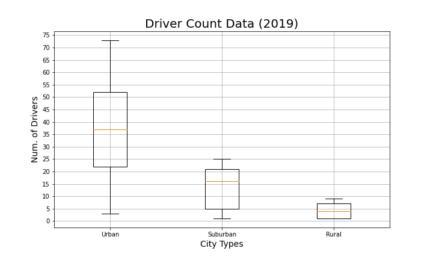

# PyBer Analysis
Data Analysis with Matplotlib

## Overview
The overall purpose of this project was to provide visual analysis of the performance of a rideshare company (PyBer), and it's drivers, across three different city types - urban, suburban, and rural. The starting data consisted of two separate CSVs, sampled from the first half of 2019, one of ride data and the other of regional markets.

The CSV of anonymized ride data contained:
- the name of the city in which the ride took place,
- date & time of the ride,
- the ride fare,
- a unique ride ID number.

The CSV consisting of regional market data, contained:
- city names,
- the number of drivers in each city,
- how that city was classified (urban, suburban, or rural).

Early analysis of the data focused on painting an overall picture of the service's performance. The following charts were created in this effort:

## Results

## Summary