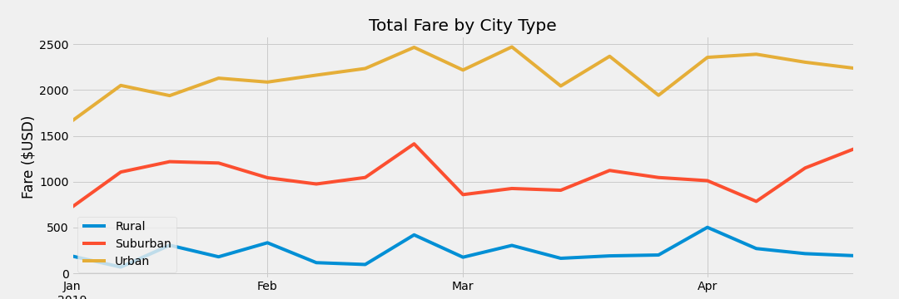

# PyBer Analysis
Data Analysis with Matplotlib

## Overview
The overall purpose of this project was to provide visual analysis of the performance of a rideshare company, and it's drivers, across different city types. 

## Results

## Summary