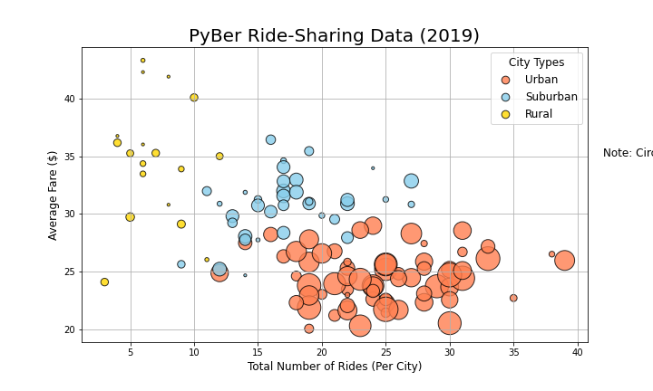
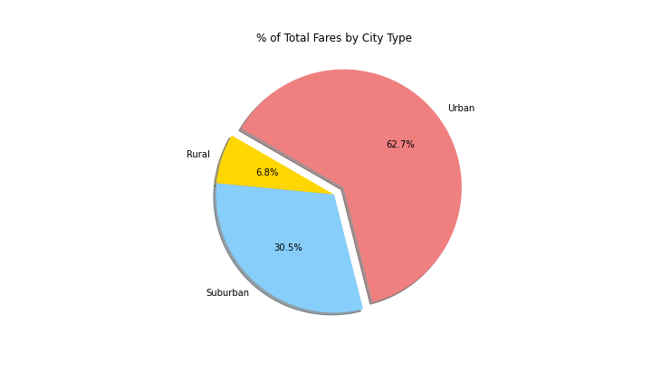

# PyBer Analysis
Data Analysis with Matplotlib

## Overview
The overall purpose of this project was to provide visual analysis of the performance of a rideshare company (PyBer), and it's drivers, across three different city types - urban, suburban, and rural. The starting data consisted of two separate CSVs, sampled from the first half of 2019, which when combined, contained the following information: 
- the name of the city in which the ride took place,
- date & time of the ride,
- the ride fare,
- a unique ride ID number,
- the number of drivers in that given city,
- how that city was classified (urban, suburban, or rural).

Early analysis of the data focused on painting an overall picture of the service's performance, comparing and contrasting such factors as fares, number of rides, and driver counts against city types, via the use of bubble charts, bar-and-whisker plots, and pie charts. The final analysis was a summary over time for the weekly fares, grouped by city type.

## Results
The charts and graphs illustrate a significant difference in rideshare activity across the three different city types.

(***Note: the chart titles and axis labels may not be visible in Github's Dark Mode***)

This initial summary bubble chart displays the average fare of rides in a given city, charted against the total number of rides in that city. The size of the circles correlates to the number of drivers in that city, and the color of the bubbles correlates to the city type designation, as noted in the legend. What we can see right off the bat is that:
- there is much more rideshare activity, and more drivers, in urban cities compared to rural cities (and with suburban cities falling somewhere in between);
- the average fares in rural cities cover a much broader range, but trend towards being more expensive, while average fares in urban cities are less expensive. 

The ride count bar-and-whisker chart displays the range of number of rides in each city, by city type. This echos our previous chart, showing that there is much more rideshare activity in urban cities, slightly less in suburban cities, and much less in rural cities.

The ride fare bar-and-whisker chart displays the range of fares per ride within cities in each city type. 

The driver count bar-and-whisker chart displays the range of number of drivers within cities in each city type.

The fares percentage pie chart displays the fare intake by city type, as percentages of the total.

The rides percentage pie chart displays the number of rides given by city type, as percentages of the total.

The drivers percentage pie chart displays the number of drivers by city type, as percentages of the total.

While all of these charts are wonderful and enlightening, they all fail to incorporate an important factor in their analysis of the data presented.

In the final challenge for this project we are asked to produce a summary analysis that introduces the element of time.

In this fare summary line chart we can see weekly fare intake, grouped by city type.

## Summary